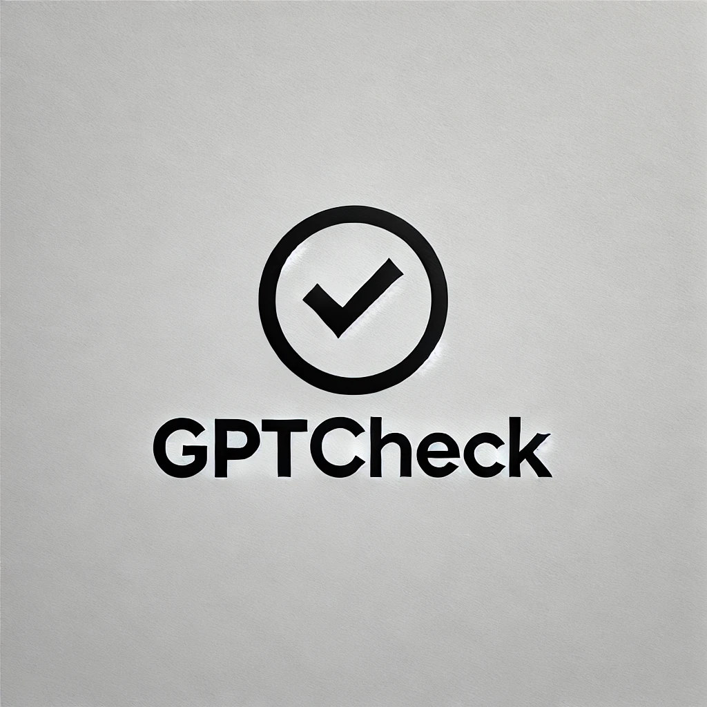

# GPTCheck: AI-Generated Text Detection Website


This project is a Flask-based Website that uses a fine-tuned DeBERTa model to detect whether a given text is AI-generated or human-written. Our model achieve Bronze Medal, Top 8% on Kaggle - LLM Detect AI Generated Text competition[https://www.kaggle.com/competitions/llm-detect-ai-generated-text].

## demo
(https://www.youtube.com/watch?v=XXjCVB6AzVg)

## Features

- Accepts a text input and returns a prediction on whether it was generated by an AI or written by a human.
- Returns the probability of the prediction, giving insight into the model's confidence.
- Easy to integrate with web applications or use as a standalone API.

## Requirements

- Python 3.8+
- Pip (Python package installer)
- CUDA (optional, for GPU support)

## Installation

1. **Clone the Repository:**

    ```bash
    git clone https://github.com/YuekaiXuEric/GPTCheck.git
    cd GPTCheck
    ```

2. **Create a Virtual Environment (Optional but recommended):**

    ```bash
    python -m venv venv
    source venv/bin/activate  # On Windows, use `venv\Scripts\activate`
    ```

3. **Install Dependencies:**

    ```bash
    pip install -r requirements.txt
    ```

    Make sure `requirements.txt` includes necessary packages like `Flask`, `torch`, `transformers`, etc.

4. **Download the Pretrained Model:**

    We have provide an DeBERTa v3 small fine tuning model. You can choose other model as you like, make sure you have a fine-tuned DeBERTa model available. Place it in the appropriate directory or adjust the model loading path in `app.py`.

## Usage

1. **Run the Flask Server:**

    ```bash
    python app.py
    ```

    The server will start and listen on `http://127.0.0.1:3000`.

2. **Run the Client:**

    ```bash
    npm run start
    ```

    The client will start and listen on `http://localhost:8080/`.

3. **Test the API:**

    You can test the API using tools like `curl`, Postman, or Thunder Client. Example using `curl`:

    ```bash
    curl -X POST -H "Content-Type: application/json" -d '{"text": "Your input text here"}' http://127.0.0.1:3000/predict
    ```

    Example response:
    ```json
    {
        "probability": 0.95
    }
    ```

## Using Thunder Client

1. **Install Thunder Client:**  
    Thunder Client is a REST API client for Visual Studio Code. Install it from the Extensions view in VS Code.

2. **Create a New Request:**
    - Method: POST
    - URL: `http://127.0.0.1:3000/predict`
    - Body: JSON
    - Example:
        ```json
        {
            "text": "Your input text here"
        }
        ```

3. **Send the Request:**  
    View the response directly in Thunder Client.

## Contributing

If you'd like to contribute, please fork the repository and use a feature branch. Pull requests are welcome.

## License

This project is licensed under the MIT License - see the [LICENSE](LICENSE) file for details.

## Acknowledgements

- [Hugging Face Transformers](https://github.com/huggingface/transformers)
- [Flask](https://github.com/pallets/flask)
- The AI and Machine Learning community

